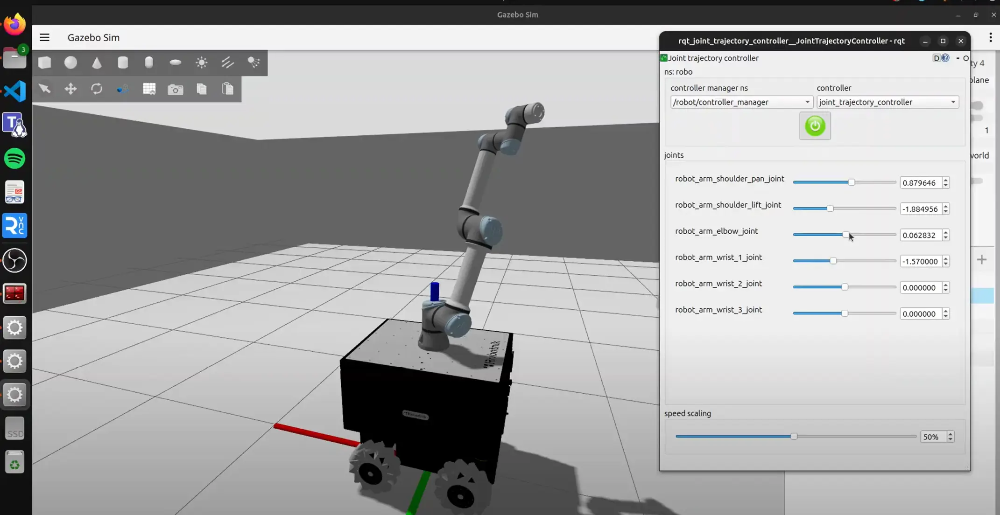

# ROS Robotics Exercises 🤖⚙️

A series of 4 hands-on ROS exercises covering custom messages, C++ nodes, differential drive URDF modeling, and adding a camera sensor with Gazebo plugins.

<div align="center">
  
</div>

<br>
<div align="center">
  <a href="https://codeload.github.com/TendoPain18/ros-robotics-exercises/legacy.zip/main">
    
  </a>
</div>

## 📋 Description

These exercises complement the ROS labs series and provide hands-on practice with ROS package creation, custom message types, C++ publishers/subscribers, URDF/Xacro robot modeling, and Gazebo sensor plugins. Each exercise includes a step-by-step guide and a complete ready-to-build ROS package.

---

## 🧪 Exercises Overview

### Exercise 1 — Custom Message: Publisher & Subscriber (Python)

**Objective:** Create a custom ROS message containing two integers, publish them, and have a subscriber sum and print the result.

**Key concepts:** Custom `.msg` files, `message_generation`, `message_runtime`, Python publisher/subscriber, `add_message_files`, `generate_messages` in `CMakeLists.txt`, launch file.

**ROS Package:** `custom_msg_example` — custom `TwoInts.msg`, Python publisher (`two_ints_publisher.py`), Python subscriber (`two_ints_subscriber.py`), and launch file.

---

### Exercise 2 — Publisher & Subscriber (C++)

**Objective:** Implement the classic talker/listener pattern in C++ using `roscpp` and `std_msgs/String`.

**Key concepts:** `ros::Publisher`, `ros::Subscriber`, `ros::NodeHandle`, `ros::spin()`, `ros::spinOnce()`, `add_executable` and `target_link_libraries` in `CMakeLists.txt`, launch file.

**ROS Package:** `cpp_talker_listener` — C++ talker (`talker.cpp`), C++ listener (`listener.cpp`), and launch file.

---

### Exercise 3 — Differential Drive Robot URDF

**Objective:** Build a differential drive robot from scratch using Xacro, including base link, left/right wheels, and a caster wheel.

**Key concepts:** Xacro file structure, `<link>` with visual/collision/inertial, `<joint>` types (continuous, fixed), cylinder and sphere geometries, material colors, joint origins and axes.

**ROS Package:** `my_robot` — `myrobot.xacro` and `myrobot.urdf` for a complete differential drive robot model.

---

### Exercise 4 — Adding a Camera Sensor in Gazebo

**Objective:** Extend the `robot_description` package from Lab 4 by adding a `camera_link` with a 3D mesh, an RGB camera Gazebo plugin, and visualizing the output in RViz.

**Key concepts:** Camera `<link>` with STL/DAE mesh, RGB camera plugin (`libgazebo_ros_camera.so`), `/camera/image_raw` topic, RViz camera visualization.

**ROS Package:** `robot_description` — Xacro robot with 2D LiDAR and camera links, `.gazebo` plugin file, multiple camera mesh options (STL, STEP, DAE), and Gazebo launch file.

---

## 📁 Repository Structure

```
ros-robotics-exercises/
├── Exercise 1/
│   ├── Exercise-1.md
│   └── custom_msg_example/       # ROS package
│       ├── msg/TwoInts.msg
│       ├── scripts/
│       │   ├── two_ints_publisher.py
│       │   └── two_ints_subscriber.py
│       └── launch/two_ints.launch
├── Exercise 2/
│   ├── Exercise-2.md
│   └── cpp_talker_listener/      # ROS package
│       ├── src/
│       │   ├── talker.cpp
│       │   └── listener.cpp
│       └── launch/talker_listener.launch
├── Exercise 3/
│   ├── differential_drive_Robot.md
│   └── my_robot/                 # ROS package
│       └── urdf/
│           ├── myrobot.xacro
│           └── myrobot.urdf
└── Exercise 4/
    ├── Exercise-4.md
    └── robot_description/        # ROS package
        ├── urdf/
        │   ├── myrobot.xacro
        │   └── myrobot.gazebo
        ├── meshes/               # Camera mesh files (STL, STEP, DAE)
        └── launch/empty_world.launch
```

## 🚀 Getting Started

**Requirements:** Ubuntu 20.04, ROS Noetic, Gazebo

```bash
# Clone into your catkin workspace
cd ~/catkin_ws/src
git clone https://github.com/TendoPain18/ros-robotics-exercises.git

# Copy individual packages into src and build
cp -r ros-robotics-exercises/Exercise\ 1/custom_msg_example .
cp -r ros-robotics-exercises/Exercise\ 2/cpp_talker_listener .
cp -r ros-robotics-exercises/Exercise\ 3/my_robot .
cp -r ros-robotics-exercises/Exercise\ 4/robot_description .

cd ~/catkin_ws
catkin_make
source devel/setup.bash
```

## 🤝 Contributing

Contributions are welcome! Feel free to add new exercises, improve the URDF models, or extend the Gazebo plugins.

## 🙏 Acknowledgments

- ROS Wiki and Gazebo ROS Plugins documentation

<br>
<div align="center">
  <a href="https://codeload.github.com/TendoPain18/ros-robotics-exercises/legacy.zip/main">
    
  </a>
</div>

## <!-- CONTACT -->
<div id="toc" align="center">
  <ul style="list-style: none">
    <summary>
      <h2 align="center">
        🚀
        CONTACT ME
        🚀
      </h2>
    </summary>
  </ul>
</div>
<table align="center" style="width: 100%; max-width: 600px;">
<tr>
  <td style="width: 20%; text-align: center;">
    <a href="https://www.linkedin.com/in/amr-ashraf-86457134a/" target="_blank">
      
    </a>
  </td>
  <td style="width: 20%; text-align: center;">
    <a href="https://github.com/TendoPain18" target="_blank">
      
    </a>
  </td>
  <td style="width: 20%; text-align: center;">
    <a href="mailto:amrgadalla01@gmail.com">
      
    </a>
  </td>
  <td style="width: 20%; text-align: center;">
    <a href="https://www.facebook.com/amr.ashraf.7311/" target="_blank">
      
    </a>
  </td>
  <td style="width: 20%; text-align: center;">
    <a href="https://wa.me/201019702121" target="_blank">
      
    </a>
  </td>
</tr>
</table>
<!-- END CONTACT -->

## **Practice makes perfect — one ROS exercise at a time! 🤖✨**
